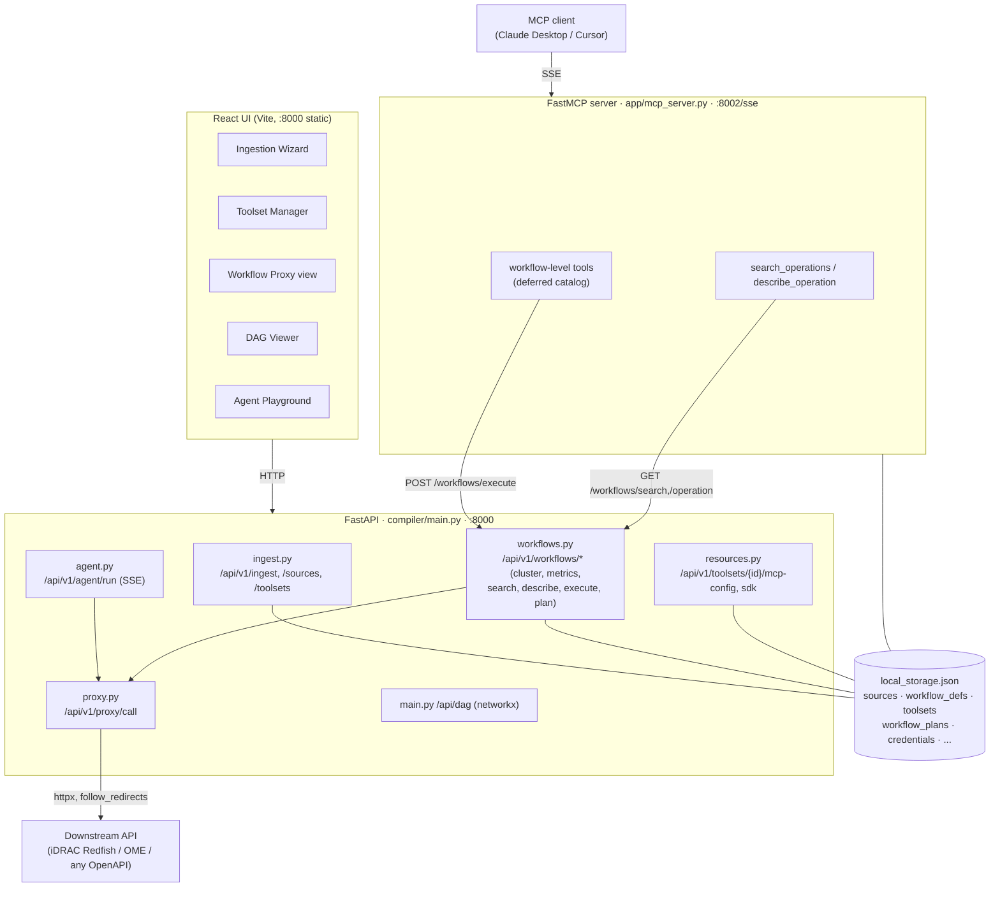

# Architecture

The MCP Workflow Proxy has three layers: a **React UI**, a **FastAPI** core that ingests specs / clusters them / proxies calls, and a **FastMCP** server that exposes the clustered workflows to MCP clients. State lives in one local JSON file. No database, no external services at the core.

## Component diagram



### ASCII fallback

```
React UI (:8000) ──HTTP──► FastAPI (compiler/main.py, :8000)
                              ├─ ingest.py    ─┐
                              ├─ workflows.py ─┤
                              ├─ resources.py ─┼──► local_storage.json
                              ├─ agent.py ─────┘        ▲
                              └─ proxy.py ──httpx──► Downstream API
                                                          │
MCP client ──SSE──► FastMCP (app/mcp_server.py, :8002/sse)
   (Claude Desktop /  ├─ workflow tools ──POST /workflows/execute──► workflows.py ──► proxy.py
    Cursor)           └─ search_operations / describe_operation ──GET /workflows/search,/operation
```

The FastMCP server is a **thin HTTP client of the FastAPI core**: its tools `POST` to `http://127.0.0.1:8000/api/v1/workflows/execute` and `GET` the search/describe endpoints (see `BACKEND` in `app/mcp_server.py`). This keeps one source of truth for clustering and execution.

## Module responsibilities

| Module | Path | Responsibility |
|---|---|---|
| App / DAG | `compiler/main.py` | FastAPI app, CORS, router wiring, `/api/dag` (networkx dependency graph via regex over the raw spec), serves the built React app. |
| Ingest | `compiler/app/ingest.py` | Parse YAML/JSON OpenAPI. Flatten paths×methods → `tools` keyed by `operation_id`. Resolve `$ref` (one level, params + request body), merge path-item-level shared params, derive Swagger 2.0 base URL from `host`+`basePath`+`schemes`, capture `tags`. Also CRUD for curated toolsets. |
| Proxy | `compiler/app/proxy.py` | Single downstream executor: resolves `base_url` + bearer credential from storage, substitutes path params, sends via httpx (`timeout=30`, `follow_redirects=True`), surfaces 429 with `Retry-After`, returns `{status_code, data}`. |
| Workflows | `compiler/app/workflows.py` | **The core.** Clustering (tag→path, profiles), `workflow_tool_schema` (with `defer_catalog`), `compute_metrics`, progressive-disclosure search/describe, the declarative plan engine (`execute_plan`), `execute_workflow` + `__report__`, named-plan storage. |
| MCP server | `compiler/app/mcp_server.py` | FastMCP over SSE (:8002). Registers one workflow tool per cluster (deferred descriptions) + `search_operations`/`describe_operation` + a generic `call_api_tool`. |
| Agent | `compiler/app/agent.py` | Provider-agnostic tool-use loop (Claude / Groq / Ollama) over a curated toolset; streams a trace (usage, tool_call, tool_result) via SSE. Truncates tool results to bound token growth. |
| Resources | `compiler/app/resources.py` | Per-toolset environments / prompts / custom tools; derived MCP connection config (Claude Desktop + Cursor) and generated SDK snippets (Python/TS/curl). |
| Storage | `compiler/app/storage.py` | Read/write `local_storage.json` (`default=str` so YAML datetime examples don't break serialization). |

## Data flows

### 1. Ingest → cluster → generate workflow tools

```
upload spec
  └─ POST /api/v1/ingest                (ingest.py)
       parse YAML/JSON → for each path×method:
         resolve $ref params, merge path-item shared params,
         derive base_url (servers[0].url, else host+basePath)
       → storage.sources[<file>] = { base_url, tools{ op_id: {...} } }

click Generate
  └─ POST /api/v1/workflows/generate?source_id=&profile=auto   (workflows.py)
       cluster_source():
         profile pass (auto-detect Redfish on /redfish/v1) → intent buckets
         generic pass → cluster_key = first tag, else first non-skip path segment
       each cluster → one workflow def { id, name, operations[], report }
       compute_metrics(raw vs workflow tool defs, inline + deferred token counts)
       → storage.workflow_defs[source_id] = workflows
       → return { workflows, metrics }
```

### 2. MCP client → workflow tool → execute → proxy → API

```
agent calls e.g. tool  redfish_wf_power_control(operation="...", path_params={...})
  └─ FastMCP tool (mcp_server.py) POSTs /api/v1/workflows/execute
       execute_workflow():
         if operation == "__report__":  list collection → foreach item → fetch detail
         else: look up op in the cluster → proxy_call(op, params)
            └─ proxy.py resolves base_url+token, substitutes path, httpx request
               → downstream API → { status_code, data }
       → aggregated JSON back to the agent
```

### 3. Progressive disclosure (search / describe)

Workflow tools are registered with **catalog-free** descriptions. To find the right operation, the agent uses two cheap tools instead of paying for every operation's schema up front:

```
search_operations(source_id, query)   GET /api/v1/workflows/search
   → AND-match query terms over operation_id + summary + path + method (≤10 hits)
describe_operation(source_id, op_id)   GET /api/v1/workflows/operation
   → full 1:1 input_schema (path/query/body) for that single op + owning workflow_id
agent then calls the workflow tool with operation=<op_id> and the right params
```

This is the architecture analog of Anthropic's "code execution with MCP" insight: don't front-load all definitions; disclose detail on demand.

## Clustering strategy

In `workflows.py`, `cluster_source(source, profile="auto")` runs two passes:

1. **Profile pass (intent-named).** If `profile="auto"`, `_detect_profile` scans operation paths; a hit on `/redfish/v1` selects `REDFISH_PROFILE`. `_cluster_with_profile` assigns each operation to the **first** profile workflow whose regex (over `"<METHOD> <path>  <operationId>"`) matches. Order matters: specific intents (Power, Firmware, Inventory) are tried before the broad Server Health Check so a `.../Actions/...Reset` lands in Power Control, not the generic health bucket.
2. **Generic pass.** Everything unmatched (or everything, if no profile) is clustered by `_cluster_key`: the operation's **first `tag`** if present (the API designer's own grouping), else the **first meaningful path segment** (skipping `api`, `v1`, `redfish`, etc. in `_SKIP_SEGMENTS`).

Each cluster collapses to one workflow def. If the cluster contains both a collection `GET` (`/things`) and an item `GET` (`/things/{id}`), `report=True` and a `__report__` multi-step operation is synthesized.

## Token-reduction design

Two compounding levers, both in `workflow_tool_schema`:

- **Clustering.** N endpoint schemas (each a full `input_schema`) become 1 workflow tool whose input is just `{operation, path_params, query_params, body}`. The per-endpoint detail moves out of the schema.
- **Deferred catalog (progressive disclosure).** With `defer_catalog=True`, the description shrinks from listing every operation (O(operations)) to a one-line verb summary (O(1)), pointing the agent to `search_operations`/`describe_operation`. This is the layered win: GitHub 158,751 → 20,288 tokens with clustering (87.2%) → **12,927 with deferral (91.9%)**.

`compute_metrics` reports both: `workflow_tokens_inline` (catalog in description) and `workflow_tokens_deferred` (catalog removed), against the `raw_tokens` baseline built from 1:1 endpoint schemas. The MCP server registers tools with `defer_catalog=True`.

## Plan engine

`execute_plan(source_id, plan, limit)` is a small declarative interpreter (Enhancement 2). A plan is an ordered list of steps; results thread between steps via **selectors**:

| Selector | Meaning |
|---|---|
| literal string | passed through unchanged |
| `$last.<dotted.path>` | reach into the previous step's JSON result |
| `$steps.<i>.<dotted.path>` | reach into step index `i`'s result |
| `item` / `item.<path>` | the current `foreach` element |
| `*` in a dotted path | map the remaining sub-path over a list (e.g. `$last.data.results.*.index`) |

Step options: `foreach` (iterate a selector's list, run the step once per element), and `until` (re-call until a selector equals a target, with `max_attempts`/`delay_ms` polling). Hard caps bound runaway agents: `MAX_PLAN_STEPS=25`, `MAX_FOREACH_ITERATIONS=25`, `MAX_POLL_ATTEMPTS=30`, plus the proxy's 30 s per-call timeout. `__report__` is implemented as an auto-generated list→`foreach`→detail plan that preserves the legacy output shape. Named plans are persisted under `workflow_plans[source_id][workflow_id][name]`.

## Key trade-offs

- **Rule-based clustering vs LLM clustering.** Tag→path heuristics are deterministic, instant, free, and reproducible — no API key, no latency, no nondeterminism at generate-time. The cost is occasionally coarse groupings on specs with poor or missing tags; intent **profiles** (Redfish) are the escape hatch for domains where heuristics aren't enough, and groupings can be regenerated with a different `profile`.
- **Generic dispatch vs per-op schemas.** One `{operation, path_params, query_params, body}` shape per workflow is what makes the token reduction possible, but it gives the agent looser per-call typing than N hand-tuned schemas. Progressive disclosure (`describe_operation`) restores exact per-op schemas *on demand*, recovering precision only when needed.
- **Truncation.** The Agent Playground truncates tool results (`MAX_TOOL_RESULT_CHARS=2500`) because results are re-sent every turn and compound token cost; the proxy/`__report__` truncate summaries and field lengths similarly. This trades completeness of a single huge payload for sane, bounded context — usually the right call for tool-use loops.

## References

- Model Context Protocol — https://spec.modelcontextprotocol.io
- FastMCP — https://gofastmcp.com
- Redfish DSP0266 — https://www.dmtf.org/standards/redfish
- iDRAC / OpenManage Enterprise developer portal — https://developer.dell.com
- Anthropic, "Code execution with MCP" — https://www.anthropic.com/engineering/code-execution-with-mcp
